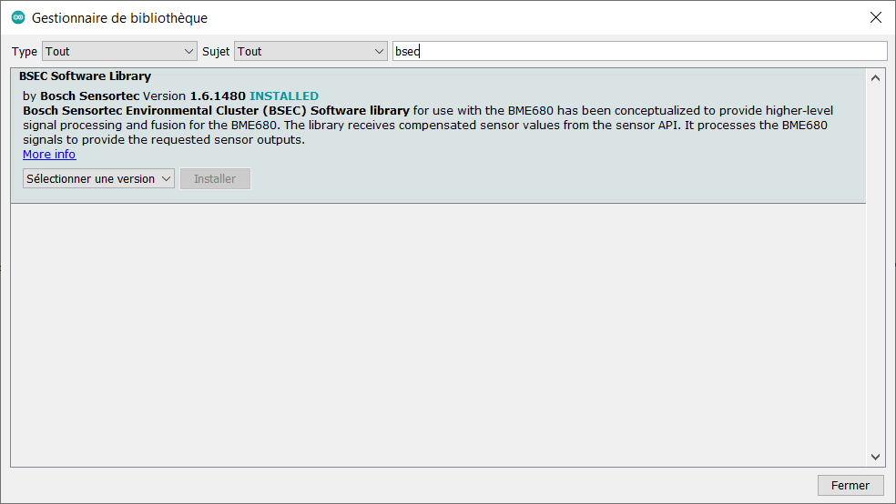

# Use a BOSCH sensor BME680 with your ESP8266

*You can find this chip (BME680) for around 5€ on marketplaces such as Aliexpress.*

> The BME680 is the first gas sensor that integrates high-linearity and high-accuracy gas, pressure, humidity and temperature sensors. In order to measure air quality for personal wellbeing the gas sensor within the BME680 can detect a broad range of gases such as volatile organic compounds (VOC). [see more](https://www.bosch-sensortec.com/products/environmental-sensors/gas-sensors-bme680/)

**In order to compute IAQ, we will use the [BOSCH library](https://github.com/BoschSensortec/BSEC-Arduino-library).**

# Wiring your sensor

In this guide we will use the BME680 with the I2C protocol as it only requires 4 wires see: [Wiring-Diagram-I2C](./images/Wiring-Diagram-I2C.png)

> It is probably good to solder the chip to avoid further problems.

# Testing the sensor

As I encountered several problems while trying to use this library, we should first test the sensor to make sure it is working

1. Flash and run on your ESP8266, the [I2C_Scanner.ino](./I2C_Scanner/I2C_Scanner.ino)
    - Open the serial monitor with the frequency : 115200 bauds
    - You should see the message : 
    
        ```bash
        Scanning...
        I2C device found at address 0x77 # this address can be either 0x76 or 0x77 !!!
        done
        ```

    > Depending on the address value we will have to **configure the BOSCH Library differently !**

1. Flash and run on your ESP8266, the [Test_BME680.ino](./Test_BME680/Test_BME680.ino)

    > You may require to install the `Adafruit Sensor` & `Adafruit BME680 Libraries`. You can proceed as the installation for the BOSCH library explained below.

    - Open the serial monitor with the frequency : 115200 bauds
    - You should see a similar message :       
        ``` python
        Reading started at 126823 and will finish at 127005
        You can do other work during BME680 measurement.
        Reading completed at 127139
        Temperature = 30.27 *C
        Pressure = 1002.13 hPa
        Humidity = 24.74 %
        Gas = 328.68 KOhms
        Approx. Altitude = 93.16 m
        ```

# Installing and using BOSCH library

You can install it by using the Arduino Library Manager :

- Go to Sketch -> Include a Library -> Manage Libraries
- Search for `bsec`
- Install it



- Open the [BOSCH-BSEC-test.ino](./BOSCH-BSEC-test/BOSCH-BSEC-test.ino) with your favorite editor

    - If you had an **adress** = **0x76**, make sure that 18th line of the file is as follow : 
        ```c
        iaqSensor.begin(BME680_I2C_ADDR_PRIMARY, Wire);
        ```

    - If you had an **adress** = **0x77**, make sure that 18th line of the file is as follow : 
        ```c
        iaqSensor.begin(BME680_I2C_ADDR_SECONDARY, Wire);
        ```
 
- Flash and run on your ESP8266
- Open the serial monitor with the frequency : 115200 bauds
- You should see a similar message:
    
    ```bash
    BSEC library version 1.4.6.0
    BSEC warning code : 10
    Timestamp [ms], raw temperature [°C], pressure [hPa], raw relative humidity [%], gas [Ohm], IAQ, IAQ accuracy, temperature [°C], relative humidity [%], Static IAQ, CO2 equivalent, breath VOC equivalent
    98, 25.36, 99673.00, 28.73, 287150.00, 25.00, 0, 25.36, 28.73, 25.00, 400.00, 0.50
    ```