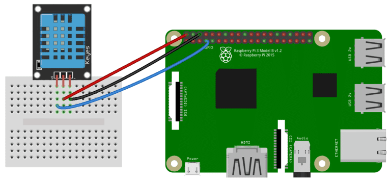

# Setup DHT11 sensor

## Requirements 📜
- Raspberry pi (3B model used)
- DHT11 sensor (3 pins model)
- 4 wires

## Getting started 🚦
- **Install the raspbian OS on the SD card and make sure everything is up to date** by running the following commands:
    ```bash
    sudo apt-get update
    sudo apt-get upgrade
    sudo apt-get autoremove
    sudo apt install git # Make sure that GIT is installed
    ```
    
    >Note : set-up the ssh server on the raspberry to use it remotely
    
    >**The beginning of this walkthrough is inspired by this [tutorial](https://www.circuitbasics.com/how-to-set-up-the-dht11-humidity-sensor-on-the-raspberry-pi/?fbclid=IwAR3uq5Hg2R0kgsMNYw9q53nmce8G6b0RWgneogkoEkEK2UokpAWENadLSHI)**

- Connect the DHT11 sensor to the raspberry following this architecture :

    

- We’ll be using the Adafruit DHT11 Python library. You can download the library using Git, so if you don’t have Git installed on your Pi already, enter this at the command prompt: `sudo apt-get install git-core`

    >Note: If you get an error installing Git, run sudo apt-get update and try it again.

- Install the Adafruit DHT11 library:

    ```bash
    # Clone the project
    git clone https://github.com/adafruit/Adafruit_Python_DHT.git
    # Install python dependency
    sudo apt-get install build-essential python-dev
    # Install the library
    cd Adafruit_Python_DHT
    sudo python setup.py install
    ```

- **Test your installation**

    ```bash
    # Go back to your project directory
    cd .. 
    # Create and edit a new python file
    nano try.py
    ```
    Pasthe the following code

    ```python
    #!/usr/bin/python
        import sys
        import Adafruit_DHT
        
        while True:
    
        humidity, temperature = Adafruit_DHT.read_retry(11, 4)
    
        print 'Temp: {0:0.1f} C  Humidity: {1:0.1f} %'.format(temperature, humidity)
    ```

    Run the script
    
    ```bash
    python test.py
    ```

    You should see a similmar output:
    
    ```bash
    pi@raspberrypi:~/IOT $ python try.py
    Temp: 24.0 C  Humidity: 66.0 %
    Temp: 23.0 C  Humidity: 68.0 %
    Temp: 23.0 C  Humidity: 68.0 %
    Temp: 23.0 C  Humidity: 67.0 %
    ```

To be continued...
    