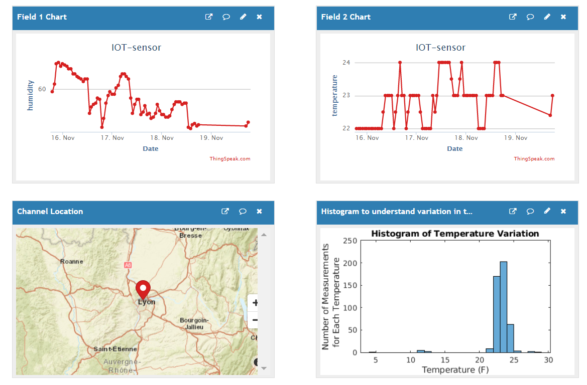

# IOT-air-quality 

This project aims at creating a portable device that allows you to monitor air quality.




# Requirements 📜
- **Raspberry pi** (3B model used) OR **ESP8266 Module**
- DHT11 sensor (3 pins model)
- 3 wires

# Getting started 🚦

### Setup the project by running these commands on your raspberry (or computer if ESP8266 targeted)

```bash
cd                          # go at your home directory
mkdir IOT && cd ./IOT       # create IOT directory and enter in it
sudo apt install git        # Make sure that GIT is installed
git clone https://github.com/aballiet/IOT-air-quality.git
```

1. **[Setup your DHT11 sensor](./DHT11/README.md)**
1. Choose your Database platform 
    - **[Ready to use ThingSpeak](./ThingSpeak/README.md)** : no requirements
    - **[Setup a single ELK node](./ELK/README.md)** : requires a server instance

## Automate with crontab (raspberry only) 🤖
Once everything is setup, you can automate the uploading/measuring task thanks to crontab.

```bash
crontab -e
```
Then add the following line depending on the storage you want to use

```bash
*/10 * * * * bash $HOME/IOT/IOT-air-quality/cron_measure_elk.sh    # upload to your Elastic instance
*/10 * * * * bash $HOME/IOT/IOT-air-quality/cron_measure_ts.sh     # upload to your ThinkSpeak channel
```

This specific part at the beginning : `*/10 * * * *` defines the refresh rate of the script. It corresponds to a measure/upload **each 10 minutes**. See [this](https://crontab.guru/) link to help you write your refresh rate.