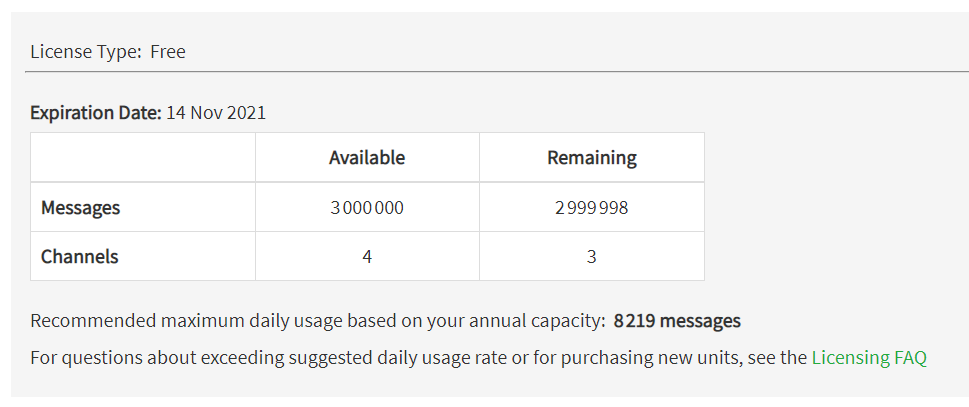
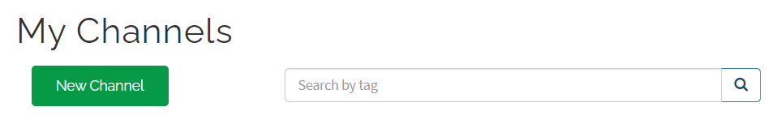
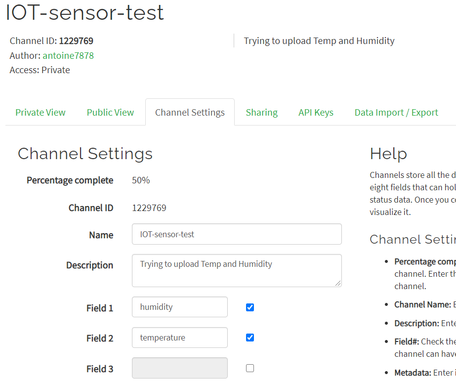

# Configure ThingSpeak to receive your Data
As Elastic requires an always running server (in our case we use a cluster).

Elastic as a service a.k.a **self-hosted** has **no free plan** (see [here](https://www.elastic.co/fr/pricing/)) as a result when the cluster will be shut down, we will have to find another solution.

ThingSpeak provides channels (kind of pipeline) that allow you to store your data and create live charts very easily.

*Free plan is enough for basic use cases*


> Refresh rate is limited at once per 15 seconds maximul (way enough for sensors we are using)

## Setup your account :
1. browse [thingspeak.com](https://thingspeak.com/)
1. Connect with your MATLAB account (MATHWORKS) if you have or create a new account
1. browse [channels](https://thingspeak.com/channels)
1. Create a channel
    

1. Configure 
    
    > For the moment we only need 2 fields : temperature and humidity

1. get your API Keys in the `API Keys` section
    There are 2 types of keys:
    - Write key - the one we need to send data to our Database
    - Read key  - used in order to perform request on our already saved data
    
1. setup the environment

```bash
cd ThingSpeak
nano .env
```
add the line :
```bash
TS_API_KEY_WRITE=<YOUR_WRITE_API_KEY>
```


    

